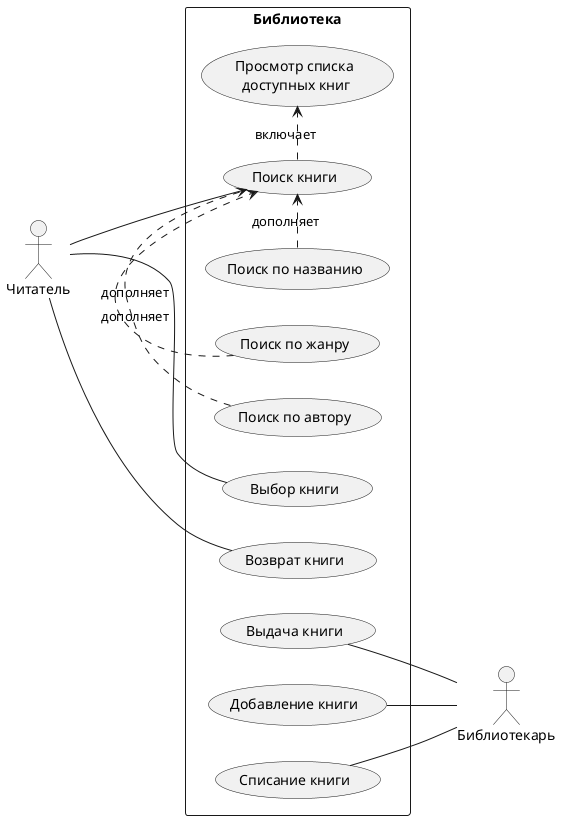
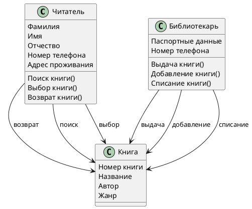
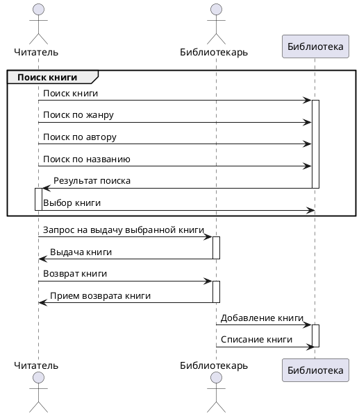

# Практическая работа 1
## Вариант 2
Диаграмма вариантов использования:

```plantuml
@startuml
left to right direction
skinparam packageStyle rectangle
actor Читатель
actor Библиотекарь
rectangle Библиотека {
  
  Читатель -- (Поиск книги)
  Читатель -- (Выбор книги)
  Читатель -- (Возврат книги)
  (Поиск по названию) .> (Поиск книги) : дополняет
  (Поиск по жанру) .> (Поиск книги) : дополняет
  (Поиск по автору) .> (Поиск книги) : дополняет
  (Выдача книги) -- Библиотекарь
  (Добавление книги) -- Библиотекарь
  (Списание книги) -- Библиотекарь
  (Поиск книги) .> (Просмотр списка\n доступных книг) : включает
  

}
@enduml
```

Диаграмма классов:

```plantuml
@startuml
Читатель --> Книга: возврат
Читатель --> Книга: поиск
Читатель --> Книга: выбор
Библиотекарь --> Книга: выдача
Библиотекарь --> Книга: добавление
Библиотекарь --> Книга: списание

class Читатель {
  Фамилия
  Имя
  Отчество
  Номер телефона
  Адрес проживания
  Поиск книги()
  Выбор книги()
  Возврат книги()
}

class Книга {
  Номер книги
  Название
  Автор
  Жанр
}

class Библиотекарь {
  Паспортные данные
  Номер телефона
  Выдача книги()
  Добавление книги()
  Списание книги()
}
@enduml
```

Диаграмма последовательности:

```plantuml
@startuml
actor Читатель 
actor Библиотекарь
group Поиск книги
Читатель -> Библиотека: Поиск книги
activate Библиотека
Читатель -> Библиотека: Поиск по жанру
Читатель -> Библиотека: Поиск по автору
Читатель -> Библиотека: Поиск по названию
Библиотека -> Читатель: Результат поиска
deactivate Библиотека
activate Читатель 
Читатель -> Библиотека: Выбор книги
deactivate Читатель 
end

Читатель -> Библиотекарь: Запрос на выдачу выбранной книги
activate Библиотекарь
Библиотекарь -> Читатель: Выдача книги
deactivate Библиотекарь

Читатель -> Библиотекарь: Возврат книги
activate Библиотекарь
Библиотекарь -> Читатель: Прием возврата книги
deactivate Библиотекарь

Библиотекарь -> Библиотека: Добавление книги
activate Библиотека
Библиотекарь -> Библиотека: Списание книги
deactivate Библиотека
@enduml
```

