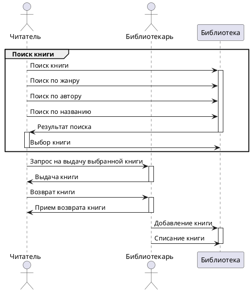
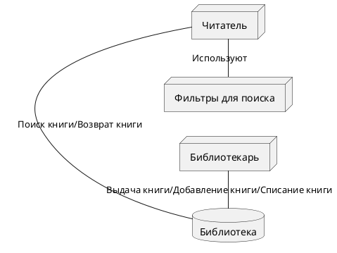

# Практическая работа 2
## Вариант 2
Диаграмма последовательности:

```plantuml
@startuml
actor Читатель 
actor Библиотекарь
group Поиск книги
Читатель -> Библиотека: Поиск книги
activate Библиотека
Читатель -> Библиотека: Поиск по жанру
Читатель -> Библиотека: Поиск по автору
Читатель -> Библиотека: Поиск по названию
Библиотека -> Читатель: Результат поиска
deactivate Библиотека
activate Читатель 
Читатель -> Библиотека: Выбор книги
deactivate Читатель 
end

Читатель -> Библиотекарь: Запрос на выдачу выбранной книги
activate Библиотекарь
Библиотекарь -> Читатель: Выдача книги
deactivate Библиотекарь

Читатель -> Библиотекарь: Возврат книги
activate Библиотекарь
Библиотекарь -> Читатель: Прием возврата книги
deactivate Библиотекарь

Библиотекарь -> Библиотека: Добавление книги
activate Библиотека
Библиотекарь -> Библиотека: Списание книги
deactivate Библиотека
@enduml
```

Диаграмма развертывания:

```plantuml
@startuml 
left to right direction
database Библиотека
node Читатель
node Библиотекарь
node "Фильтры для поиска"

Читатель - Библиотека: Поиск книги/Возврат книги
Библиотекарь - Библиотека: Выдача книги/Добавление книги/Списание книги
Читатель - "Фильтры для поиска": Используют

@enduml
```

